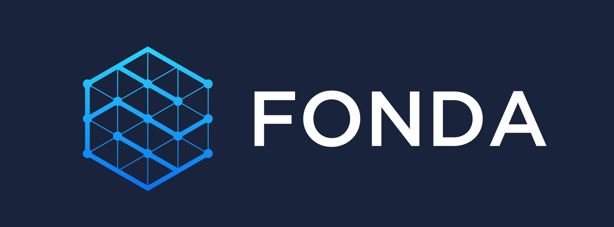

<h1>
  <picture>
    <source media="(prefers-color-scheme: dark)" srcset="docs/images/nf-core-rangeland_logo_dark.png">
    
  </picture>
</h1>

[](https://github.com/nf-core/rangeland/actions/workflows/ci.yml)
[](https://github.com/nf-core/rangeland/actions/workflows/linting.yml)[](https://nf-co.re/rangeland/results)[](https://doi.org/10.5281/zenodo.XXXXXXX)
[](https://www.nf-test.com)

[](https://www.nextflow.io/)
[](https://docs.conda.io/en/latest/)
[](https://www.docker.com/)
[](https://sylabs.io/docs/)
[](https://cloud.seqera.io/launch?pipeline=https://github.com/nf-core/rangeland)

[](https://nfcore.slack.com/channels/rangeland)[](https://twitter.com/nf_core)[](https://mstdn.science/@nf_core)[](https://www.youtube.com/c/nf-core)

## Introduction

**nf-core/rangeland** is a geographical best-practice analysis pipeline for remotely sensed imagery. The pipeline processes satellite imagery alongside auxiliary data in multiple steps to arrive at a set of trend files related to land-cover changes. The main pipeline steps are:

1. Read satellite imagery, digital elevation model, endmember definition, water vapor database and area of interest definition
2. Generate allow list and analysis mask to determine which pixels from the satellite data can be used
3. Preprocess data to obtain atmospherically corrected images alongside quality assurance information
4. Classify pixels by applying linear spectral unmixing
5. Time series analyses to obtain trends in vegetation dynamics
6. Create mosaic and pyramid visualizations of the results

7. Read QC ([`FastQC`](https://www.bioinformatics.babraham.ac.uk/projects/fastqc/))
8. Present QC for raw reads ([`MultiQC`](http://multiqc.info/))

## Usage

> [!NOTE]
> If you are new to Nextflow and nf-core, please refer to [this page](https://nf-co.re/docs/usage/installation) on how to set-up Nextflow. Make sure to [test your setup](https://nf-co.re/docs/usage/introduction#how-to-run-a-pipeline) with `-profile test` before running the workflow on actual data.

To run the pipeline on real data, input data needs to be acquired. Concretely, satellite imagery, water vapor data, a digital elevation model, endmember definitions, a datacube specification, and a area-of-interest specification are required. Please refer to the [usage documentation](https://nf-co.re/rangeland/usage) for details on the input structure.

Now, you can run the pipeline using:

```bash
nextflow run nf-core/rangeland/main.nf \
   -profile <docker/singularity/.../institute> \
   --input <SATELLITE IMAGES> \
   --dem <DIGITAL ELEVATION MODEL> \
   --wvdb <WATER VAPOR DATA> \
   --data_cube <DATA CUBE> \
   --aoi <AREA OF INTEREST> \
   --endmember <ENDMEMBER SPECIFICATION> \
   --outdir <OUTDIR>
```

> [!WARNING]
> Please provide pipeline parameters via the CLI or Nextflow `-params-file` option. Custom config files including those provided by the `-c` Nextflow option can be used to provide any configuration _**except for parameters**_;
> see [docs](https://nf-co.re/usage/configuration#custom-configuration-files).

For more details and further functionality, please refer to the [usage documentation](https://nf-co.re/rangeland/usage) and the [parameter documentation](https://nf-co.re/rangeland/parameters).

## Pipeline output

To see the results of an example test run with a full size dataset refer to the [results](https://nf-co.re/rangeland/results) tab on the nf-core website pipeline page.
For more details about the output files and reports, please refer to the
[output documentation](https://nf-co.re/rangeland/output).

## Credits

The rangeland workflow was originally written by:

- [Fabian Lehmann](https://github.com/Lehmann-Fabian)
- [David Frantz](https://github.com/davidfrantz)

The original workflow can be found on [github](https://github.com/CRC-FONDA/FORCE2NXF-Rangeland).

Transformation to nf-core/rangeland was conducted by [Felix Kummer](https://github.com/Felix-Kummer). nf-core alignment started on the [nf-core branch of the original repository](https://github.com/CRC-FONDA/FORCE2NXF-Rangeland/tree/nf-core).

We thank the following people for their extensive assistance in the development of this pipeline:

- [Fabian Lehmann](https://github.com/Lehmann-Fabian)
- [Katarzyna Ewa Lewinska](https://github.com/kelewinska).

## Acknowledgements

This pipeline was developed and aligned with nf-core as part of the [Foundations of Workflows for Large-Scale Scientific Data Analysis (FONDA)](https://fonda.hu-berlin.de/) initiative.

[](https://fonda.hu-berlin.de/)

FONDA can be cited as follows:

> **The Collaborative Research Center FONDA.**
>
> Ulf Leser, Marcus Hilbrich, Claudia Draxl, Peter Eisert, Lars Grunske, Patrick Hostert, Dagmar Kainmüller, Odej Kao, Birte Kehr, Timo Kehrer, Christoph Koch, Volker Markl, Henning Meyerhenke, Tilmann Rabl, Alexander Reinefeld, Knut Reinert, Kerstin Ritter, Björn Scheuermann, Florian Schintke, Nicole Schweikardt, Matthias Weidlich.
>
> _Datenbank Spektrum_ 2021 doi: [10.1007/s13222-021-00397-5](https://doi.org/10.1007/s13222-021-00397-5)

## Contributions and Support

If you would like to contribute to this pipeline, please see the [contributing guidelines](.github/CONTRIBUTING.md).

For further information or help, don't hesitate to get in touch on the [Slack `#rangeland` channel](https://nfcore.slack.com/channels/rangeland) (you can join with [this invite](https://nf-co.re/join/slack)).

## Citations

<!-- TODO nf-core: Add citation for pipeline after first release. Uncomment lines below and update Zenodo doi and badge at the top of this file. -->
<!-- If you use nf-core/rangeland for your analysis, please cite it using the following doi: [10.5281/zenodo.XXXXXX](https://doi.org/10.5281/zenodo.XXXXXX) -->

An extensive list of references for the tools used by the pipeline can be found in the [`CITATIONS.md`](CITATIONS.md) file.

You can cite the `nf-core` publication as follows:

> **The nf-core framework for community-curated bioinformatics pipelines.**
>
> Philip Ewels, Alexander Peltzer, Sven Fillinger, Harshil Patel, Johannes Alneberg, Andreas Wilm, Maxime Ulysse Garcia, Paolo Di Tommaso & Sven Nahnsen.
>
> _Nat Biotechnol._ 2020 Feb 13. doi: [10.1038/s41587-020-0439-x](https://dx.doi.org/10.1038/s41587-020-0439-x).

This pipeline is based one the publication listed below. The publication can be cited as follows:

> **FORCE on Nextflow: Scalable Analysis of Earth Observation Data on Commodity Clusters**
>
> [Lehmann, F., Frantz, D., Becker, S., Leser, U., Hostert, P. (2021). FORCE on Nextflow: Scalable Analysis of Earth Observation Data on Commodity Clusters. In CIKM Workshops.](https://www.informatik.hu-berlin.de/de/forschung/gebiete/wbi/research/publications/2021/force_nextflow.pdf/@@download/file/force_nextflow.pdf)
